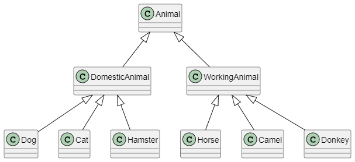

**1. Используя команду cat в терминале операционной системы Linux, создать
два файла Домашние животные (заполнив файл собаками, кошками,
хомяками) и Вьючные животными заполнив файл Лошадьми, верблюдами и
ослы), а затем объединить их. Просмотреть содержимое созданного файла.
Переименовать файл, дав ему новое имя (Друзья человека)**

```
# Создание файла "Домашние животные" и заполнение его данными
echo "Собаки" > Домашние_животные
echo "Кошки" >> Домашние_животные
echo "Хомяки" >> Домашние_животные

# Создание файла "Вьючные животные" и заполнение его данными
echo "Лошади" > Вьючные_животные
echo "Верблюды" >> Вьючные_животные
echo "Ослы" >> Вьючные_животные
```

```
root@Ubuntu:/home/nuanred# ls
Desktop   Documents  Music     Public    snap       test         test_text  Videos            Домашние_животные
docker_5  Downloads  Pictures  seminar5  Templates  test_docker  testzsh    Вьючные_животные
```

**Объединение содержимого файлов в один файл Друзья человека**

```
root@Ubuntu:/home/nuanred#
root@Ubuntu:/home/nuanred# cat Домашние_животные Вьючные_животные > Друзья_человека
root@Ubuntu:/home/nuanred# cat Друзья_человека
Собаки
Кошки
Хомяки
Лошади
Верблюды
Ослы
root@Ubuntu:/home/nuanred#
```

**Создаем директорию Животные и перемещаем туда файл **

```

root@Ubuntu:/home/nuanred# mkdir Животные
root@Ubuntu:/home/nuanred# ll
total 148
drwxr-x--- 23 nuanred nuanred 4096 апр 30 20:55 ./
drwxr-xr-x  3 root    root    4096 мая 18  2023 ../
-rw-------  1 nuanred nuanred 3335 мар 17 22:01 .bash_history
-rw-r--r--  1 nuanred nuanred  220 мая 18  2023 .bash_logout
-rw-r--r--  1 nuanred nuanred 3771 мая 18  2023 .bashrc
drwx------ 13 nuanred nuanred 4096 мар  1 22:36 .cache/
drwx------ 12 nuanred nuanred 4096 мар  1 22:36 .config/
drwxr-xr-x  2 nuanred nuanred 4096 мая 18  2023 Desktop/
drwxr-xr-x  2 root    root    4096 мар 23 13:17 docker_5/
drwxr-xr-x  2 nuanred nuanred 4096 мая 18  2023 Documents/
drwxr-xr-x  2 nuanred nuanred 4096 мая 18  2023 Downloads/
drwx------  2 nuanred nuanred 4096 мая 18  2023 .gnupg/
-rw-------  1 nuanred nuanred   20 мар  1 22:54 .lesshst
drwx------  3 nuanred nuanred 4096 мая 18  2023 .local/
drwxr-xr-x  2 nuanred nuanred 4096 мая 18  2023 Music/
-rw-r--r--  1 nuanred nuanred  310 мар  1 22:15 .pam_environment
drwxr-xr-x  2 nuanred nuanred 4096 мая 18  2023 Pictures/
-rw-r--r--  1 nuanred nuanred  807 мая 18  2023 .profile
drwxr-xr-x  2 nuanred nuanred 4096 мая 18  2023 Public/
drwxr-xr-x  2 root    root    4096 мар 14 20:37 seminar5/
drwx------  6 nuanred nuanred 4096 мар  7 22:22 snap/
drwx------  2 nuanred nuanred 4096 мая 18  2023 .ssh/
drwxr-xr-x  2 nuanred nuanred 4096 мая 18  2023 Templates/
drwxr-xr-x  3 root    root    4096 мар  8 00:04 test/
drwxr-xr-x  2 root    root    4096 мар 17 12:08 test_docker/
drwxr-xr-x  2 root    root    4096 мар  3 21:05 test_text/
drwxr-xr-x  5 root    root    4096 мар 15 16:15 testzsh/
-rw-r-----  1 nuanred nuanred    5 апр 30 20:44 .vboxclient-clipboard.pid
-rw-r-----  1 nuanred nuanred    5 апр 30 20:44 .vboxclient-draganddrop.pid
-rw-r-----  1 nuanred nuanred    5 апр 30 20:44 .vboxclient-seamless.pid
-rw-r-----  1 nuanred nuanred    5 апр 30 20:44 .vboxclient-vmsvga-session-tty2.pid
drwxr-xr-x  2 nuanred nuanred 4096 мая 18  2023 Videos/
-rw-------  1 nuanred nuanred  104 апр 30 20:54 .Xauthority
-rw-r--r--  1 root    root      39 апр 30 20:44 Вьючные_животные
-rw-r--r--  1 root    root      37 апр 30 20:44 Домашние_животные
-rw-r--r--  1 root    root      76 апр 30 20:54 Друзья_человека
drwxr-xr-x  2 root    root    4096 апр 30 20:55 Животные/

```

**Переносим файл Друзья_человека в Животные**

```
root@Ubuntu:/home/nuanred# mv Друзья_человека Животные/
root@Ubuntu:/home/nuanred# ll
total 144
drwxr-x--- 23 nuanred nuanred 4096 апр 30 21:00 ./
drwxr-xr-x  3 root    root    4096 мая 18  2023 ../
-rw-------  1 nuanred nuanred 3335 мар 17 22:01 .bash_history
-rw-r--r--  1 nuanred nuanred  220 мая 18  2023 .bash_logout
-rw-r--r--  1 nuanred nuanred 3771 мая 18  2023 .bashrc
drwx------ 13 nuanred nuanred 4096 мар  1 22:36 .cache/
drwx------ 12 nuanred nuanred 4096 мар  1 22:36 .config/
drwxr-xr-x  2 nuanred nuanred 4096 мая 18  2023 Desktop/
drwxr-xr-x  2 root    root    4096 мар 23 13:17 docker_5/
drwxr-xr-x  2 nuanred nuanred 4096 мая 18  2023 Documents/
drwxr-xr-x  2 nuanred nuanred 4096 мая 18  2023 Downloads/
drwx------  2 nuanred nuanred 4096 мая 18  2023 .gnupg/
-rw-------  1 nuanred nuanred   20 мар  1 22:54 .lesshst
drwx------  3 nuanred nuanred 4096 мая 18  2023 .local/
drwxr-xr-x  2 nuanred nuanred 4096 мая 18  2023 Music/
-rw-r--r--  1 nuanred nuanred  310 мар  1 22:15 .pam_environment
drwxr-xr-x  2 nuanred nuanred 4096 мая 18  2023 Pictures/
-rw-r--r--  1 nuanred nuanred  807 мая 18  2023 .profile
drwxr-xr-x  2 nuanred nuanred 4096 мая 18  2023 Public/
drwxr-xr-x  2 root    root    4096 мар 14 20:37 seminar5/
drwx------  6 nuanred nuanred 4096 мар  7 22:22 snap/
drwx------  2 nuanred nuanred 4096 мая 18  2023 .ssh/
drwxr-xr-x  2 nuanred nuanred 4096 мая 18  2023 Templates/
drwxr-xr-x  3 root    root    4096 мар  8 00:04 test/
drwxr-xr-x  2 root    root    4096 мар 17 12:08 test_docker/
drwxr-xr-x  2 root    root    4096 мар  3 21:05 test_text/
drwxr-xr-x  5 root    root    4096 мар 15 16:15 testzsh/
-rw-r-----  1 nuanred nuanred    5 апр 30 20:44 .vboxclient-clipboard.pid
-rw-r-----  1 nuanred nuanred    5 апр 30 20:44 .vboxclient-draganddrop.pid
-rw-r-----  1 nuanred nuanred    5 апр 30 20:44 .vboxclient-seamless.pid
-rw-r-----  1 nuanred nuanred    5 апр 30 20:44 .vboxclient-vmsvga-session-tty2.pid
drwxr-xr-x  2 nuanred nuanred 4096 мая 18  2023 Videos/
-rw-------  1 nuanred nuanred  104 апр 30 20:54 .Xauthority
-rw-r--r--  1 root    root      39 апр 30 20:44 Вьючные_животные
-rw-r--r--  1 root    root      37 апр 30 20:44 Домашние_животные
drwxr-xr-x  2 root    root    4096 апр 30 21:00 Животные/
root@Ubuntu:/home/nuanred# ll Животные/
total 12
drwxr-xr-x  2 root    root    4096 апр 30 21:00 ./
drwxr-x--- 23 nuanred nuanred 4096 апр 30 21:00 ../
-rw-r--r--  1 root    root      76 апр 30 20:54 Друзья_человека
root@Ubuntu:/home/nuanred#
```

**Подключить дополнительный репозиторий MySQL. Установить любой пакет
из этого репозитория**

```

root@Ubuntu:/home/nuanred# sudo apt update
Hit:1 http://ru.archive.ubuntu.com/ubuntu jammy InRelease
Hit:2 http://ru.archive.ubuntu.com/ubuntu jammy-updates InRelease
Hit:3 http://ru.archive.ubuntu.com/ubuntu jammy-backports InRelease
Hit:4 https://download.docker.com/linux/ubuntu jammy InRelease
Hit:5 http://security.ubuntu.com/ubuntu jammy-security InRelease
Reading package lists... Done
Building dependency tree... Done
Reading state information... Done
262 packages can be upgraded. Run 'apt list --upgradable' to see them.
root@Ubuntu:/home/nuanred# sudo apt install software-properties-common
Reading package lists... Done
Building dependency tree... Done
Reading state information... Done
The following additional packages will be installed:
  python3-software-properties software-properties-gtk
The following packages will be upgraded:
  python3-software-properties software-properties-common software-properties-gtk
3 upgraded, 0 newly installed, 0 to remove and 259 not upgraded.
Need to get 114 kB of archives.
After this operation, 8 192 B of additional disk space will be used.
Do you want to continue? [Y/n] Y
Get:1 http://ru.archive.ubuntu.com/ubuntu jammy-updates/main amd64 software-properties-common all 0.99.22.9 [14,1 kB]
Get:2 http://ru.archive.ubuntu.com/ubuntu jammy-updates/main amd64 software-properties-gtk all 0.99.22.9 [71,3 kB]
Get:3 http://ru.archive.ubuntu.com/ubuntu jammy-updates/main amd64 python3-software-properties all 0.99.22.9 [28,8 kB]
Fetched 114 kB in 0s (904 kB/s)
(Reading database ... 244942 files and directories currently installed.)
Preparing to unpack .../software-properties-common_0.99.22.9_all.deb ...
Unpacking software-properties-common (0.99.22.9) over (0.99.22.5) ...
Preparing to unpack .../software-properties-gtk_0.99.22.9_all.deb ...
Unpacking software-properties-gtk (0.99.22.9) over (0.99.22.5) ...
Preparing to unpack .../python3-software-properties_0.99.22.9_all.deb ...
Unpacking python3-software-properties (0.99.22.9) over (0.99.22.5) ...
Setting up python3-software-properties (0.99.22.9) ...
Setting up software-properties-common (0.99.22.9) ...
Setting up software-properties-gtk (0.99.22.9) ...
Processing triggers for dbus (1.12.20-2ubuntu4.1) ...
Processing triggers for shared-mime-info (2.1-2) ...
Processing triggers for mailcap (3.70+nmu1ubuntu1) ...
Processing triggers for desktop-file-utils (0.26-1ubuntu3) ...
Processing triggers for hicolor-icon-theme (0.17-2) ...
Processing triggers for gnome-menus (3.36.0-1ubuntu3) ...
Processing triggers for libglib2.0-0:amd64 (2.72.4-0ubuntu2.2) ...
Processing triggers for man-db (2.10.2-1) ...
root@Ubuntu:/home/nuanred#


```

**Ставим MYSQL**

```

root@Ubuntu:/home/nuanred# sudo apt install mysql-server
Reading package lists... Done
Building dependency tree... Done
Reading state information... Done
mysql-server is already the newest version (8.0.36-0ubuntu0.22.04.1).
0 upgraded, 0 newly installed, 0 to remove and 259 not upgraded.
root@Ubuntu:/home/nuanred#


```

**Установка и удаление deb пакета**
качаем пакет

```

root@Ubuntu:/var/cache# sudo wget -c https://dev.mysql.com/get/mysql-apt-config_0.8.24-1_all.deb
--2024-04-30 22:13:31--  https://dev.mysql.com/get/mysql-apt-config_0.8.24-1_all.deb
Resolving dev.mysql.com (dev.mysql.com)... 23.54.13.213, 2a02:26f0:9500:98f::2e31, 2a02:26f0:9500:98d::2e31
Connecting to dev.mysql.com (dev.mysql.com)|23.54.13.213|:443... connected.
HTTP request sent, awaiting response... 302 Moved Temporarily
Location: https://repo.mysql.com//mysql-apt-config_0.8.24-1_all.deb [following]
--2024-04-30 22:13:32--  https://repo.mysql.com//mysql-apt-config_0.8.24-1_all.deb
Resolving repo.mysql.com (repo.mysql.com)... 23.37.58.58, 2a02:26f0:e2:780::1d68, 2a02:26f0:e2:782::1d68
Connecting to repo.mysql.com (repo.mysql.com)|23.37.58.58|:443... connected.
HTTP request sent, awaiting response... 200 OK
Length: 18048 (18K) [application/x-debian-package]
Saving to: ‘mysql-apt-config_0.8.24-1_all.deb’

mysql-apt-config_0.8.24-1_all.deb                   100%[=================================================================================================================>]  17,62K  --.-KB/s    in 0s

2024-04-30 22:13:32 (201 MB/s) - ‘mysql-apt-config_0.8.24-1_all.deb’ saved [18048/18048]

root@Ubuntu:/var/cache# sudo dpkq -i mysql-apt-config_0.8.24-1_all.deb
sudo: dpkq: command not found
root@Ubuntu:/var/cache# sudo dpkg -i mysql-apt-config_0.8.24-1_all.deb
Selecting previously unselected package mysql-apt-config.
(Reading database ... 245328 files and directories currently installed.)
Preparing to unpack mysql-apt-config_0.8.24-1_all.deb ...
Unpacking mysql-apt-config (0.8.24-1) ...
Setting up mysql-apt-config (0.8.24-1) ...
Warning: apt-key should not be used in scripts (called from postinst maintainerscript of the package mysql-apt-config)
Warning: apt-key is deprecated. Manage keyring files in trusted.gpg.d instead (see apt-key(8)).
OK
root@Ubuntu:/var/cache#


```

**Ставим GIMP и удаляем**

```

root@Ubuntu:~# sudo apt install gimp
Reading package lists... Done
Building dependency tree... Done
Reading state information... Done
The following additional packages will be installed:
  gimp-data graphviz i965-va-driver intel-media-va-driver libaacs0 libamd2 libann0 libaom3 libavcodec58 libavformat58 libavutil56 libbabl-0.1-0 libbdplus0 libblas3 libbluray2 libcamd2 libccolamd2 libcdt5
  libcgraph6 libcholmod3 libchromaprint1 libcodec2-1.0 libdav1d5 libde265-0 libgegl-0.4-0 libgegl-common libgfortran5 libgimp2.0 libgme0 libgsm1 libgts-0.7-5 libgts-bin libgvc6 libgvpr2 libheif1
  libigdgmm12 libilmbase25 liblab-gamut1 liblapack3 libmetis5 libmfx1 libmng2 libmypaint-1.5-1 libmypaint-common libnorm1 libopenexr25 libopenmpt0 libpathplan4 libpgm-5.3-0 librabbitmq4 libshine3
  libsnappy1v5 libsrt1.4-gnutls libssh-gcrypt-4 libswresample3 libswscale5 libudfread0 libumfpack5 libva-drm2 libva-x11-2 libva2 libvdpau1 libx264-163 libx265-199 libxvidcore4 libzmq5 libzvbi-common
  libzvbi0 mesa-va-drivers mesa-vdpau-drivers ocl-icd-libopencl1 va-driver-all vdpau-driver-all
Suggested packages:
  gimp-help-en | gimp-help gimp-data-extras gsfonts graphviz-doc i965-va-driver-shaders libcuda1 libnvcuvid1 libnvidia-encode1 libbluray-bdj opencl-icd libvdpau-va-gl1
The following NEW packages will be installed:
  gimp gimp-data graphviz i965-va-driver intel-media-va-driver libaacs0 libamd2 libann0 libaom3 libavcodec58 libavformat58 libavutil56 libbabl-0.1-0 libbdplus0 libblas3 libbluray2 libcamd2 libccolamd2
  libcdt5 libcgraph6 libcholmod3 libchromaprint1 libcodec2-1.0 libdav1d5 libde265-0 libgegl-0.4-0 libgegl-common libgfortran5 libgimp2.0 libgme0 libgsm1 libgts-0.7-5 libgts-bin libgvc6 libgvpr2 libheif1
  libigdgmm12 libilmbase25 liblab-gamut1 liblapack3 libmetis5 libmfx1 libmng2 libmypaint-1.5-1 libmypaint-common libnorm1 libopenexr25 libopenmpt0 libpathplan4 libpgm-5.3-0 librabbitmq4 libshine3
  libsnappy1v5 libsrt1.4-gnutls libssh-gcrypt-4 libswresample3 libswscale5 libudfread0 libumfpack5 libva-drm2 libva-x11-2 libva2 libvdpau1 libx264-163 libx265-199 libxvidcore4 libzmq5 libzvbi-common
  libzvbi0 mesa-va-drivers mesa-vdpau-drivers ocl-icd-libopencl1 va-driver-all vdpau-driver-all
0 upgraded, 74 newly installed, 0 to remove and 259 not upgraded.
Need to get 0 B/62,2 MB of archives.
After this operation, 250 MB of additional disk space will be used.
Do you want to continue? [Y/n] Y
Extracting templates from packages: 100%
Selecting previously unselected package libbabl-0.1-0:amd64.
(Reading database ... 245333 files and directories currently installed.)
Preparing to unpack .../00-libbabl-0.1-0_1%3a0.1.92-1_amd64.deb ...
Unpacking libbabl-0.1-0:amd64 (1:0.1.92-1) ...
Selecting previously unselected package libaom3:amd64.
Preparing to unpack .../01-libaom3_3.3.0-1_amd64.deb ...
Unpacking libaom3:amd64 (3.3.0-1) ...
Selecting previously unselected package libva2:amd64.
Preparing to unpack .../02-libva2_2.14.0-1_amd64.deb ...
Unpacking libva2:amd64 (2.14.0-1) ...
Selecting previously unselected package libmfx1:amd64.
Preparing to unpack .../03-libmfx1_22.3.0-1_amd64.deb ...
Unpacking libmfx1:amd64 (22.3.0-1) ...
Selecting previously unselected package libva-drm2:amd64.
Preparing to unpack .../04-libva-drm2_2.14.0-1_amd64.deb ...
Unpacking libva-drm2:amd64 (2.14.0-1) ...
Selecting previously unselected package libva-x11-2:amd64.
Preparing to unpack .../05-libva-x11-2_2.14.0-1_amd64.deb ...
Unpacking libva-x11-2:amd64 (2.14.0-1) ...
Selecting previously unselected package libvdpau1:amd64.
Preparing to unpack .../06-libvdpau1_1.4-3build2_amd64.deb ...
Unpacking libvdpau1:amd64 (1.4-3build2) ...
Selecting previously unselected package ocl-icd-libopencl1:amd64.
Preparing to unpack .../07-ocl-icd-libopencl1_2.2.14-3_amd64.deb ...
Unpacking ocl-icd-libopencl1:amd64 (2.2.14-3) ...
Selecting previously unselected package libavutil56:amd64.
Preparing to unpack .../08-libavutil56_7%3a4.4.2-0ubuntu0.22.04.1_amd64.deb ...
Unpacking libavutil56:amd64 (7:4.4.2-0ubuntu0.22.04.1) ...
Selecting previously unselected package libcodec2-1.0:amd64.
Preparing to unpack .../09-libcodec2-1.0_1.0.1-3_amd64.deb ...
Unpacking libcodec2-1.0:amd64 (1.0.1-3) ...
Selecting previously unselected package libdav1d5:amd64.
Preparing to unpack .../10-libdav1d5_0.9.2-1_amd64.deb ...
Unpacking libdav1d5:amd64 (0.9.2-1) ...
Selecting previously unselected package libgsm1:amd64.
Preparing to unpack .../11-libgsm1_1.0.19-1_amd64.deb ...
Unpacking libgsm1:amd64 (1.0.19-1) ...
Selecting previously unselected package libshine3:amd64.
Preparing to unpack .../12-libshine3_3.1.1-2_amd64.deb ...
Unpacking libshine3:amd64 (3.1.1-2) ...
Selecting previously unselected package libsnappy1v5:amd64.
Preparing to unpack .../13-libsnappy1v5_1.1.8-1build3_amd64.deb ...
Unpacking libsnappy1v5:amd64 (1.1.8-1build3) ...
Selecting previously unselected package libswresample3:amd64.
Preparing to unpack .../14-libswresample3_7%3a4.4.2-0ubuntu0.22.04.1_amd64.deb ...
Unpacking libswresample3:amd64 (7:4.4.2-0ubuntu0.22.04.1) ...
Selecting previously unselected package libx264-163:amd64.
Preparing to unpack .../15-libx264-163_2%3a0.163.3060+git5db6aa6-2build1_amd64.deb ...
Unpacking libx264-163:amd64 (2:0.163.3060+git5db6aa6-2build1) ...
Selecting previously unselected package libx265-199:amd64.
Preparing to unpack .../16-libx265-199_3.5-2_amd64.deb ...
Unpacking libx265-199:amd64 (3.5-2) ...
Selecting previously unselected package libxvidcore4:amd64.
Preparing to unpack .../17-libxvidcore4_2%3a1.3.7-1_amd64.deb ...
Unpacking libxvidcore4:amd64 (2:1.3.7-1) ...
Selecting previously unselected package libzvbi-common.
Preparing to unpack .../18-libzvbi-common_0.2.35-19_all.deb ...
Unpacking libzvbi-common (0.2.35-19) ...
Selecting previously unselected package libzvbi0:amd64.
Preparing to unpack .../19-libzvbi0_0.2.35-19_amd64.deb ...
Unpacking libzvbi0:amd64 (0.2.35-19) ...
Selecting previously unselected package libavcodec58:amd64.
Preparing to unpack .../20-libavcodec58_7%3a4.4.2-0ubuntu0.22.04.1_amd64.deb ...
Unpacking libavcodec58:amd64 (7:4.4.2-0ubuntu0.22.04.1) ...
Selecting previously unselected package libudfread0:amd64.
Preparing to unpack .../21-libudfread0_1.1.2-1_amd64.deb ...
Unpacking libudfread0:amd64 (1.1.2-1) ...
Selecting previously unselected package libbluray2:amd64.
Preparing to unpack .../22-libbluray2_1%3a1.3.1-1_amd64.deb ...
Unpacking libbluray2:amd64 (1:1.3.1-1) ...
Selecting previously unselected package libchromaprint1:amd64.
Preparing to unpack .../23-libchromaprint1_1.5.1-2_amd64.deb ...
Unpacking libchromaprint1:amd64 (1.5.1-2) ...
Selecting previously unselected package libgme0:amd64.
Preparing to unpack .../24-libgme0_0.6.3-2_amd64.deb ...
Unpacking libgme0:amd64 (0.6.3-2) ...
Selecting previously unselected package libopenmpt0:amd64.
Preparing to unpack .../25-libopenmpt0_0.6.1-1_amd64.deb ...
Unpacking libopenmpt0:amd64 (0.6.1-1) ...
Selecting previously unselected package librabbitmq4:amd64.
Preparing to unpack .../26-librabbitmq4_0.10.0-1ubuntu2_amd64.deb ...
Unpacking librabbitmq4:amd64 (0.10.0-1ubuntu2) ...
Selecting previously unselected package libsrt1.4-gnutls:amd64.
Preparing to unpack .../27-libsrt1.4-gnutls_1.4.4-4_amd64.deb ...
Unpacking libsrt1.4-gnutls:amd64 (1.4.4-4) ...
Selecting previously unselected package libssh-gcrypt-4:amd64.
Preparing to unpack .../28-libssh-gcrypt-4_0.9.6-2ubuntu0.22.04.3_amd64.deb ...
Unpacking libssh-gcrypt-4:amd64 (0.9.6-2ubuntu0.22.04.3) ...
Selecting previously unselected package libnorm1:amd64.
Preparing to unpack .../29-libnorm1_1.5.9+dfsg-2_amd64.deb ...
Unpacking libnorm1:amd64 (1.5.9+dfsg-2) ...
Selecting previously unselected package libpgm-5.3-0:amd64.
Preparing to unpack .../30-libpgm-5.3-0_5.3.128~dfsg-2_amd64.deb ...
Unpacking libpgm-5.3-0:amd64 (5.3.128~dfsg-2) ...
Selecting previously unselected package libzmq5:amd64.
Preparing to unpack .../31-libzmq5_4.3.4-2_amd64.deb ...
Unpacking libzmq5:amd64 (4.3.4-2) ...
Selecting previously unselected package libavformat58:amd64.
Preparing to unpack .../32-libavformat58_7%3a4.4.2-0ubuntu0.22.04.1_amd64.deb ...
Unpacking libavformat58:amd64 (7:4.4.2-0ubuntu0.22.04.1) ...
Selecting previously unselected package libilmbase25:amd64.
Preparing to unpack .../33-libilmbase25_2.5.7-2_amd64.deb ...
Unpacking libilmbase25:amd64 (2.5.7-2) ...
Selecting previously unselected package libopenexr25:amd64.
Preparing to unpack .../34-libopenexr25_2.5.7-1_amd64.deb ...
Unpacking libopenexr25:amd64 (2.5.7-1) ...
Selecting previously unselected package libswscale5:amd64.
Preparing to unpack .../35-libswscale5_7%3a4.4.2-0ubuntu0.22.04.1_amd64.deb ...
Unpacking libswscale5:amd64 (7:4.4.2-0ubuntu0.22.04.1) ...
Selecting previously unselected package libamd2:amd64.
Preparing to unpack .../36-libamd2_1%3a5.10.1+dfsg-4build1_amd64.deb ...
Unpacking libamd2:amd64 (1:5.10.1+dfsg-4build1) ...
Selecting previously unselected package libblas3:amd64.
Preparing to unpack .../37-libblas3_3.10.0-2ubuntu1_amd64.deb ...
Unpacking libblas3:amd64 (3.10.0-2ubuntu1) ...
Selecting previously unselected package libcamd2:amd64.
Preparing to unpack .../38-libcamd2_1%3a5.10.1+dfsg-4build1_amd64.deb ...
Unpacking libcamd2:amd64 (1:5.10.1+dfsg-4build1) ...
Selecting previously unselected package libccolamd2:amd64.
Preparing to unpack .../39-libccolamd2_1%3a5.10.1+dfsg-4build1_amd64.deb ...
Unpacking libccolamd2:amd64 (1:5.10.1+dfsg-4build1) ...
Selecting previously unselected package libgfortran5:amd64.
Preparing to unpack .../40-libgfortran5_12.3.0-1ubuntu1~22.04_amd64.deb ...
Unpacking libgfortran5:amd64 (12.3.0-1ubuntu1~22.04) ...
Selecting previously unselected package liblapack3:amd64.
Preparing to unpack .../41-liblapack3_3.10.0-2ubuntu1_amd64.deb ...
Unpacking liblapack3:amd64 (3.10.0-2ubuntu1) ...
Selecting previously unselected package libmetis5:amd64.
Preparing to unpack .../42-libmetis5_5.1.0.dfsg-7build2_amd64.deb ...
Unpacking libmetis5:amd64 (5.1.0.dfsg-7build2) ...
Selecting previously unselected package libcholmod3:amd64.
Preparing to unpack .../43-libcholmod3_1%3a5.10.1+dfsg-4build1_amd64.deb ...
Unpacking libcholmod3:amd64 (1:5.10.1+dfsg-4build1) ...
Selecting previously unselected package libumfpack5:amd64.
Preparing to unpack .../44-libumfpack5_1%3a5.10.1+dfsg-4build1_amd64.deb ...
Unpacking libumfpack5:amd64 (1:5.10.1+dfsg-4build1) ...
Selecting previously unselected package libgegl-common.
Preparing to unpack .../45-libgegl-common_1%3a0.4.34-1build1_all.deb ...
Unpacking libgegl-common (1:0.4.34-1build1) ...
Selecting previously unselected package libgegl-0.4-0:amd64.
Preparing to unpack .../46-libgegl-0.4-0_1%3a0.4.34-1build1_amd64.deb ...
Unpacking libgegl-0.4-0:amd64 (1:0.4.34-1build1) ...
Selecting previously unselected package libgimp2.0:amd64.
Preparing to unpack .../47-libgimp2.0_2.10.30-1ubuntu0.1_amd64.deb ...
Unpacking libgimp2.0:amd64 (2.10.30-1ubuntu0.1) ...
Selecting previously unselected package gimp-data.
Preparing to unpack .../48-gimp-data_2.10.30-1ubuntu0.1_all.deb ...
Unpacking gimp-data (2.10.30-1ubuntu0.1) ...
Selecting previously unselected package libann0.
Preparing to unpack .../49-libann0_1.1.2+doc-7build1_amd64.deb ...
Unpacking libann0 (1.1.2+doc-7build1) ...
Selecting previously unselected package libcdt5:amd64.
Preparing to unpack .../50-libcdt5_2.42.2-6_amd64.deb ...
Unpacking libcdt5:amd64 (2.42.2-6) ...
Selecting previously unselected package libcgraph6:amd64.
Preparing to unpack .../51-libcgraph6_2.42.2-6_amd64.deb ...
Unpacking libcgraph6:amd64 (2.42.2-6) ...
Selecting previously unselected package libgts-0.7-5:amd64.
Preparing to unpack .../52-libgts-0.7-5_0.7.6+darcs121130-5_amd64.deb ...
Unpacking libgts-0.7-5:amd64 (0.7.6+darcs121130-5) ...
Selecting previously unselected package libpathplan4:amd64.
Preparing to unpack .../53-libpathplan4_2.42.2-6_amd64.deb ...
Unpacking libpathplan4:amd64 (2.42.2-6) ...
Selecting previously unselected package libgvc6.
Preparing to unpack .../54-libgvc6_2.42.2-6_amd64.deb ...
Unpacking libgvc6 (2.42.2-6) ...
Selecting previously unselected package libgvpr2:amd64.
Preparing to unpack .../55-libgvpr2_2.42.2-6_amd64.deb ...
Unpacking libgvpr2:amd64 (2.42.2-6) ...
Selecting previously unselected package liblab-gamut1:amd64.
Preparing to unpack .../56-liblab-gamut1_2.42.2-6_amd64.deb ...
Unpacking liblab-gamut1:amd64 (2.42.2-6) ...
Selecting previously unselected package graphviz.
Preparing to unpack .../57-graphviz_2.42.2-6_amd64.deb ...
Unpacking graphviz (2.42.2-6) ...
Selecting previously unselected package libde265-0:amd64.
Preparing to unpack .../58-libde265-0_1.0.8-1ubuntu0.3_amd64.deb ...
Unpacking libde265-0:amd64 (1.0.8-1ubuntu0.3) ...
Selecting previously unselected package libheif1:amd64.
Preparing to unpack .../59-libheif1_1.12.0-2build1_amd64.deb ...
Unpacking libheif1:amd64 (1.12.0-2build1) ...
Selecting previously unselected package libmng2:amd64.
Preparing to unpack .../60-libmng2_2.0.3+dfsg-3_amd64.deb ...
Unpacking libmng2:amd64 (2.0.3+dfsg-3) ...
Selecting previously unselected package libmypaint-common.
Preparing to unpack .../61-libmypaint-common_1.6.0-2_all.deb ...
Unpacking libmypaint-common (1.6.0-2) ...
Selecting previously unselected package libmypaint-1.5-1:amd64.
Preparing to unpack .../62-libmypaint-1.5-1_1.6.0-2_amd64.deb ...
Unpacking libmypaint-1.5-1:amd64 (1.6.0-2) ...
Selecting previously unselected package gimp.
Preparing to unpack .../63-gimp_2.10.30-1ubuntu0.1_amd64.deb ...
Unpacking gimp (2.10.30-1ubuntu0.1) ...
Selecting previously unselected package libigdgmm12:amd64.
Preparing to unpack .../64-libigdgmm12_22.1.2+ds1-1_amd64.deb ...
Unpacking libigdgmm12:amd64 (22.1.2+ds1-1) ...
Selecting previously unselected package intel-media-va-driver:amd64.
Preparing to unpack .../65-intel-media-va-driver_22.3.1+dfsg1-1ubuntu2_amd64.deb ...
Unpacking intel-media-va-driver:amd64 (22.3.1+dfsg1-1ubuntu2) ...
Selecting previously unselected package libaacs0:amd64.
Preparing to unpack .../66-libaacs0_0.11.1-1_amd64.deb ...
Unpacking libaacs0:amd64 (0.11.1-1) ...
Selecting previously unselected package libbdplus0:amd64.
Preparing to unpack .../67-libbdplus0_0.2.0-1_amd64.deb ...
Unpacking libbdplus0:amd64 (0.2.0-1) ...
Selecting previously unselected package libgts-bin.
Preparing to unpack .../68-libgts-bin_0.7.6+darcs121130-5_amd64.deb ...
Unpacking libgts-bin (0.7.6+darcs121130-5) ...
Selecting previously unselected package mesa-va-drivers:amd64.
Preparing to unpack .../69-mesa-va-drivers_23.2.1-1ubuntu3.1~22.04.2_amd64.deb ...
Unpacking mesa-va-drivers:amd64 (23.2.1-1ubuntu3.1~22.04.2) ...
Selecting previously unselected package mesa-vdpau-drivers:amd64.
Preparing to unpack .../70-mesa-vdpau-drivers_23.2.1-1ubuntu3.1~22.04.2_amd64.deb ...
Unpacking mesa-vdpau-drivers:amd64 (23.2.1-1ubuntu3.1~22.04.2) ...
Selecting previously unselected package i965-va-driver:amd64.
Preparing to unpack .../71-i965-va-driver_2.4.1+dfsg1-1_amd64.deb ...
Unpacking i965-va-driver:amd64 (2.4.1+dfsg1-1) ...
Selecting previously unselected package va-driver-all:amd64.
Preparing to unpack .../72-va-driver-all_2.14.0-1_amd64.deb ...
Unpacking va-driver-all:amd64 (2.14.0-1) ...
Selecting previously unselected package vdpau-driver-all:amd64.
Preparing to unpack .../73-vdpau-driver-all_1.4-3build2_amd64.deb ...
Unpacking vdpau-driver-all:amd64 (1.4-3build2) ...
Setting up libgme0:amd64 (0.6.3-2) ...
Setting up libssh-gcrypt-4:amd64 (0.9.6-2ubuntu0.22.04.3) ...
Setting up libsrt1.4-gnutls:amd64 (1.4.4-4) ...
Setting up libudfread0:amd64 (1.1.2-1) ...
Setting up libamd2:amd64 (1:5.10.1+dfsg-4build1) ...
Setting up libaom3:amd64 (3.3.0-1) ...
Setting up librabbitmq4:amd64 (0.10.0-1ubuntu2) ...
Setting up libmng2:amd64 (2.0.3+dfsg-3) ...
Setting up libcodec2-1.0:amd64 (1.0.1-3) ...
Setting up libshine3:amd64 (3.1.1-2) ...
Setting up libmypaint-common (1.6.0-2) ...
Setting up libgsm1:amd64 (1.0.19-1) ...
Setting up libpgm-5.3-0:amd64 (5.3.128~dfsg-2) ...
Setting up libbabl-0.1-0:amd64 (1:0.1.92-1) ...
Setting up liblab-gamut1:amd64 (2.42.2-6) ...
Setting up libnorm1:amd64 (1.5.9+dfsg-2) ...
Setting up libilmbase25:amd64 (2.5.7-2) ...
Setting up libmetis5:amd64 (5.1.0.dfsg-7build2) ...
Setting up libigdgmm12:amd64 (22.1.2+ds1-1) ...
Setting up libxvidcore4:amd64 (2:1.3.7-1) ...
Setting up libmypaint-1.5-1:amd64 (1.6.0-2) ...
Setting up libsnappy1v5:amd64 (1.1.8-1build3) ...
Setting up libopenexr25:amd64 (2.5.7-1) ...
Setting up libgts-0.7-5:amd64 (0.7.6+darcs121130-5) ...
Setting up libcamd2:amd64 (1:5.10.1+dfsg-4build1) ...
Setting up libblas3:amd64 (3.10.0-2ubuntu1) ...
update-alternatives: using /usr/lib/x86_64-linux-gnu/blas/libblas.so.3 to provide /usr/lib/x86_64-linux-gnu/libblas.so.3 (libblas.so.3-x86_64-linux-gnu) in auto mode
Setting up libva2:amd64 (2.14.0-1) ...
Setting up libpathplan4:amd64 (2.42.2-6) ...
Setting up libann0 (1.1.2+doc-7build1) ...
Setting up libx264-163:amd64 (2:0.163.3060+git5db6aa6-2build1) ...
Setting up intel-media-va-driver:amd64 (22.3.1+dfsg1-1ubuntu2) ...
Setting up libaacs0:amd64 (0.11.1-1) ...
Setting up libgfortran5:amd64 (12.3.0-1ubuntu1~22.04) ...
Setting up libx265-199:amd64 (3.5-2) ...
Setting up libbdplus0:amd64 (0.2.0-1) ...
Setting up gimp-data (2.10.30-1ubuntu0.1) ...
Setting up libva-drm2:amd64 (2.14.0-1) ...
Setting up ocl-icd-libopencl1:amd64 (2.2.14-3) ...
Setting up libvdpau1:amd64 (1.4-3build2) ...
Setting up libccolamd2:amd64 (1:5.10.1+dfsg-4build1) ...
Setting up libgegl-common (1:0.4.34-1build1) ...
Setting up libcdt5:amd64 (2.42.2-6) ...
Setting up libcgraph6:amd64 (2.42.2-6) ...
Setting up mesa-va-drivers:amd64 (23.2.1-1ubuntu3.1~22.04.2) ...
Setting up libdav1d5:amd64 (0.9.2-1) ...
Setting up libmfx1:amd64 (22.3.0-1) ...
Setting up libbluray2:amd64 (1:1.3.1-1) ...
Setting up libde265-0:amd64 (1.0.8-1ubuntu0.3) ...
Setting up libva-x11-2:amd64 (2.14.0-1) ...
Setting up libopenmpt0:amd64 (0.6.1-1) ...
Setting up libzvbi-common (0.2.35-19) ...
Setting up i965-va-driver:amd64 (2.4.1+dfsg1-1) ...
Setting up mesa-vdpau-drivers:amd64 (23.2.1-1ubuntu3.1~22.04.2) ...
Setting up libzvbi0:amd64 (0.2.35-19) ...
Setting up libgts-bin (0.7.6+darcs121130-5) ...
Setting up liblapack3:amd64 (3.10.0-2ubuntu1) ...
update-alternatives: using /usr/lib/x86_64-linux-gnu/lapack/liblapack.so.3 to provide /usr/lib/x86_64-linux-gnu/liblapack.so.3 (liblapack.so.3-x86_64-linux-gnu) in auto mode
Setting up libzmq5:amd64 (4.3.4-2) ...
Setting up libheif1:amd64 (1.12.0-2build1) ...
Setting up libavutil56:amd64 (7:4.4.2-0ubuntu0.22.04.1) ...
Setting up va-driver-all:amd64 (2.14.0-1) ...
Setting up libgvc6 (2.42.2-6) ...
Setting up libgvpr2:amd64 (2.42.2-6) ...
Setting up vdpau-driver-all:amd64 (1.4-3build2) ...
Setting up libswscale5:amd64 (7:4.4.2-0ubuntu0.22.04.1) ...
Setting up libcholmod3:amd64 (1:5.10.1+dfsg-4build1) ...
Setting up graphviz (2.42.2-6) ...
Setting up libswresample3:amd64 (7:4.4.2-0ubuntu0.22.04.1) ...
Setting up libumfpack5:amd64 (1:5.10.1+dfsg-4build1) ...
Setting up libavcodec58:amd64 (7:4.4.2-0ubuntu0.22.04.1) ...
Setting up libchromaprint1:amd64 (1.5.1-2) ...
Setting up libavformat58:amd64 (7:4.4.2-0ubuntu0.22.04.1) ...
Setting up libgegl-0.4-0:amd64 (1:0.4.34-1build1) ...
Setting up libgimp2.0:amd64 (2.10.30-1ubuntu0.1) ...
Setting up gimp (2.10.30-1ubuntu0.1) ...
Processing triggers for hicolor-icon-theme (0.17-2) ...
Processing triggers for gnome-menus (3.36.0-1ubuntu3) ...
Processing triggers for libc-bin (2.35-0ubuntu3.6) ...
Processing triggers for man-db (2.10.2-1) ...
Processing triggers for mailcap (3.70+nmu1ubuntu1) ...
Processing triggers for desktop-file-utils (0.26-1ubuntu3) ...
root@Ubuntu:~# sudo dpkg -P gimp
(Reading database ... 250605 files and directories currently installed.)
Removing gimp (2.10.30-1ubuntu0.1) ...
Processing triggers for man-db (2.10.2-1) ...
Processing triggers for mailcap (3.70+nmu1ubuntu1) ...
Processing triggers for gnome-menus (3.36.0-1ubuntu3) ...
Processing triggers for desktop-file-utils (0.26-1ubuntu3) ...
root@Ubuntu:~#


```

** Создаем таблицы для животных**

```
CREATE DATABASE FriendsOfHuman;

USE FriendsOfHuman;

CREATE TABLE `animal`
(
  `id` Int NOT NULL AUTO_INCREMENT,
  `animal_name` Varchar(20) NOT NULL,
  PRIMARY KEY (`id`)
);


CREATE TABLE `home_animal`
(
  `id` Int NOT NULL AUTO_INCREMENT,
  `home_name` Varchar(20) NOT NULL,
  `livePlace` Varchar(20),
  `id_animal` Int,
  PRIMARY KEY (`id`)
);


CREATE TABLE `cat`
(
  `id` Int NOT NULL AUTO_INCREMENT,
  `cat_name` Varchar(30) NOT NULL,
  `date_birth` Date NOT NULL,
  `commands` Varchar(200),
  `color` Varchar(20),
  `id_home` Int,
  PRIMARY KEY (`id`)
);


CREATE TABLE `dog`
(
  `id` Int NOT NULL AUTO_INCREMENT,
  `dog_name` Varchar(30) NOT NULL,
  `date_birth` Date NOT NULL,
  `commands` Varchar(200),
  `color` Varchar(20),
  `id_home` Int,
  PRIMARY KEY (`id`)
);


CREATE TABLE `hamster`
(
  `id` Int NOT NULL AUTO_INCREMENT,
  `hamster_name` Varchar(30) NOT NULL,
  `date_birth` Date NOT NULL,
  `commands` Varchar(200),
  `color` Varchar(20),
  `id_home` Int,
  PRIMARY KEY (`id`)
);


CREATE TABLE `pack_animal`
(
  `id` Int NOT NULL AUTO_INCREMENT,
  `pack_name` Varchar(20) NOT NULL,
  `livePlace` Varchar(20),
  `id_animal` Int,
  PRIMARY KEY (`id`)
);


CREATE TABLE `camel`
(
  `id` Int NOT NULL AUTO_INCREMENT,
  `name` Varchar(30) NOT NULL,
  `date_birth` Date NOT NULL,
  `commands` Varchar(200),
  `color` Varchar(20),
  `id_pack` Int,
  PRIMARY KEY (`id`)
);

---- Заполняем значениями
-- Добавляем данные в таблицу animal
INSERT INTO animal (animal_name) VALUES ('Cat'), ('Dog'), ('Hamster'), ('Camel'), ('Horse'), ('Mule');

-- Добавляем данные в таблицу home_animal
INSERT INTO home_animal (home_name, livePlace, id_animal) VALUES
('Fluffy', 'House', 1),
('Rex', 'Garden', 2),
('Nibbles', 'Cage', 3);

-- Добавляем данные в таблицы cat, dog и hamster
INSERT INTO cat (cat_name, date_birth, commands, color, id_home) VALUES
('Whiskers', '2018-05-10', 'Sleep, Play, Eat', 'Gray', 1),
('Smokey', '2019-02-15', 'Meow, Scratch', 'Black', 2);

INSERT INTO dog (dog_name, date_birth, commands, color, id_home) VALUES
('Buddy', '2017-07-20', 'Sit, Fetch, Roll Over', 'Brown', 2),
('Max', '2016-10-25', 'Stay, Shake, Speak', 'White', 2);

INSERT INTO hamster (hamster_name, date_birth, commands, color, id_home) VALUES
('Nibbles', '2020-04-05', 'Run, Eat, Sleep', 'Brown', 3),
('Fluffy', '2019-11-12', 'Run on Wheel, Eat Sunflower Seeds', 'White', 3);

-- Добавляем данные в таблицы pack_animal, camel, horse и mule
INSERT INTO pack_animal (pack_name, livePlace, id_animal) VALUES
('Desert Caravan', 'Desert', 4),
('Stable', 'Farm', 5),
('Pack Train', 'Mountain', 6);

INSERT INTO camel (name, date_birth, commands, color, id_pack) VALUES
('Amelia', '2015-08-20', 'Carry, Walk, Rest', 'Brown', 1),
('Oscar', '2017-04-12', 'Carry Cargo, Trek', 'Brown', 1);

INSERT INTO horse (name, date_birth, commands, color, id_pack) VALUES
('Thunder', '2016-06-30', 'Trot, Gallop, Jump', 'Brown', 2),
('Shadow', '2018-01-10', 'Walk, Canter, Pull', 'Black', 2);

INSERT INTO mule (name, date_birth, commands, color, id_pack) VALUES
('Molly', '2017-09-15', 'Carry Load, Trek, Rest', 'Gray', 3),
('Jack', '2019-03-25', 'Plow, Carry, Pull', 'Brown', 3);


CREATE TABLE `horse`
(
  `id` Int NOT NULL AUTO_INCREMENT,
  `name` Varchar(30) NOT NULL,
  `date_birth` Date NOT NULL,
  `commands` Varchar(200),
  `color` Varchar(20),
  `id_pack` Int,
  PRIMARY KEY (`id`)
);
--- Проверяем заполнение таблицу
-- Проверим таблицу animal
SELECT * FROM animal;

-- Проверим таблицу home_animal
SELECT * FROM home_animal;

-- Проверим таблицу cat
SELECT * FROM cat;

-- Проверим таблицу dog
SELECT * FROM dog;

-- Проверим таблицу hamster
SELECT * FROM hamster;

-- Проверим таблицу pack_animal
SELECT * FROM pack_animal;

-- Проверим таблицу camel
SELECT * FROM camel;

-- Проверим таблицу horse
SELECT * FROM horse;

-- Проверим таблицу mule
SELECT * FROM mule;


CREATE TABLE `mule`
(
  `id` Int NOT NULL AUTO_INCREMENT,
  `name` Varchar(30) NOT NULL,
  `date_birth` Date NOT NULL,
  `commands` Varchar(200),
  `color` Varchar(20),
  `id_pack` Int,
  PRIMARY KEY (`id`)
);


ALTER TABLE `home_animal` ADD CONSTRAINT `animal_to_home` FOREIGN KEY (`id_animal`) REFERENCES `animal` (`id`) ON DELETE RESTRICT ON UPDATE RESTRICT;

ALTER TABLE `cat` ADD CONSTRAINT `home_to_cat` FOREIGN KEY (`id_home`) REFERENCES `home_animal` (`id`) ON DELETE RESTRICT ON UPDATE RESTRICT;

ALTER TABLE `dog` ADD CONSTRAINT `home_to_dog` FOREIGN KEY (`id_home`) REFERENCES `home_animal` (`id`) ON DELETE RESTRICT ON UPDATE RESTRICT;

ALTER TABLE `hamster` ADD CONSTRAINT `home_to_hamster` FOREIGN KEY (`id_home`) REFERENCES `home_animal` (`id`) ON DELETE RESTRICT ON UPDATE RESTRICT;

ALTER TABLE `camel` ADD CONSTRAINT `pack_to_camel` FOREIGN KEY (`id_pack`) REFERENCES `pack_animal` (`id`) ON DELETE RESTRICT ON UPDATE RESTRICT;

ALTER TABLE `horse` ADD CONSTRAINT `pack_to_horse` FOREIGN KEY (`id_pack`) REFERENCES `pack_animal` (`id`) ON DELETE RESTRICT ON UPDATE RESTRICT;

ALTER TABLE `mule` ADD CONSTRAINT `pack_to_mule` FOREIGN KEY (`id_pack`) REFERENCES `pack_animal` (`id`) ON DELETE RESTRICT ON UPDATE RESTRICT;
--- Заполняем
-- Добавляем данные в таблицу animal
INSERT INTO animal (animal_name) VALUES ('Cat'), ('Dog'), ('Hamster'), ('Camel'), ('Horse'), ('Mule');

-- Добавляем данные в таблицу home_animal
INSERT INTO home_animal (home_name, livePlace, id_animal) VALUES
('Fluffy', 'House', 1),
('Rex', 'Garden', 2),
('Nibbles', 'Cage', 3);

-- Добавляем данные в таблицы cat, dog и hamster
INSERT INTO cat (cat_name, date_birth, commands, color, id_home) VALUES
('Whiskers', '2018-05-10', 'Sleep, Play, Eat', 'Gray', 1),
('Smokey', '2019-02-15', 'Meow, Scratch', 'Black', 2);

INSERT INTO dog (dog_name, date_birth, commands, color, id_home) VALUES
('Buddy', '2017-07-20', 'Sit, Fetch, Roll Over', 'Brown', 2),
('Max', '2016-10-25', 'Stay, Shake, Speak', 'White', 2);

INSERT INTO hamster (hamster_name, date_birth, commands, color, id_home) VALUES
('Nibbles', '2020-04-05', 'Run, Eat, Sleep', 'Brown', 3),
('Fluffy', '2019-11-12', 'Run on Wheel, Eat Sunflower Seeds', 'White', 3);

-- Добавляем данные в таблицы pack_animal, camel, horse и mule
INSERT INTO pack_animal (pack_name, livePlace, id_animal) VALUES
('Desert Caravan', 'Desert', 4),
('Stable', 'Farm', 5),
('Pack Train', 'Mountain', 6);

INSERT INTO camel (name, date_birth, commands, color, id_pack) VALUES
('Amelia', '2015-08-20', 'Carry, Walk, Rest', 'Brown', 1),
('Oscar', '2017-04-12', 'Carry Cargo, Trek', 'Brown', 1);

INSERT INTO horse (name, date_birth, commands, color, id_pack) VALUES
('Thunder', '2016-06-30', 'Trot, Gallop, Jump', 'Brown', 2),
('Shadow', '2018-01-10', 'Walk, Canter, Pull', 'Black', 2);

INSERT INTO mule (name, date_birth, commands, color, id_pack) VALUES
('Molly', '2017-09-15', 'Carry Load, Trek, Rest', 'Gray', 3),
('Jack', '2019-03-25', 'Plow, Carry, Pull', 'Brown', 3);
--- Проверяем
-- Проверим таблицу animal
SELECT * FROM animal;

-- Проверим таблицу home_animal
SELECT * FROM home_animal;

-- Проверим таблицу cat
SELECT * FROM cat;

-- Проверим таблицу dog
SELECT * FROM dog;

-- Проверим таблицу hamster
SELECT * FROM hamster;

-- Проверим таблицу pack_animal
SELECT * FROM pack_animal;

-- Проверим таблицу camel
SELECT * FROM camel;

-- Проверим таблицу horse
SELECT * FROM horse;

-- Проверим таблицу mule
SELECT * FROM mule;


-- Удаляем данные о верблюдах из таблицы camel
DELETE FROM camel;

-- Объединяем таблицы horse и mule
CREATE TABLE equines AS
SELECT * FROM horse
UNION ALL
SELECT * FROM mule;

-- Удаляем старые таблицы horse и mule
DROP TABLE horse;
DROP TABLE mule;

-- Проверяем
-- Проверим таблицу camel
SELECT * FROM camel;

-- Проверим таблицу equines
SELECT * FROM equines;

-- Добавим данные в таблицы
-- Добавляем данные о кошках
INSERT INTO cat (cat_name, date_birth, color)
VALUES
('Fluffy', '2020-02-10', 'Gray'),
('Whiskers', '2019-05-15', 'Black'),
('Mittens', '2018-08-20', 'White');

-- Добавляем данные о собаках
INSERT INTO dog (dog_name, date_birth, color)
VALUES
('Buddy', '2019-01-20', 'Brown'),
('Max', '2018-04-25', 'Black'),
('Bailey', '2020-06-05', 'Golden');

-- Добавляем данные о хомяках
INSERT INTO hamster (hamster_name, date_birth, color)
VALUES
('Nibbles', '2020-03-12', 'Brown'),
('Snowball', '2019-07-18', 'White'),
('Cinnamon', '2018-09-30', 'Orange');

--- Обновим данные чтобы они попали в таблицу
-- Обновляем дату рождения кошек
UPDATE cat SET date_birth = '2019-05-15' WHERE id = 3;
UPDATE cat SET date_birth = '2019-05-15' WHERE id = 4;
UPDATE cat SET date_birth = '2019-05-15' WHERE id = 5;

-- Обновляем дату рождения собак
UPDATE dog SET date_birth = '2019-01-20' WHERE id = 3;
UPDATE dog SET date_birth = '2019-01-20' WHERE id = 4;

-- Обновляем дату рождения хомяков
UPDATE hamster SET date_birth = '2019-07-18' WHERE id = 4;

-- Создадим таблицу молодых животных

CREATE TABLE young_animal (
id int NOT NULL,
name varchar(50),
date_birth Datetime,
commands varchar(200),
color varchar(20),
age varchar(50));
-- Добавляем животных
INSERT INTO young_animal (id, name, date_birth, commands, color, age)
SELECT id, cat_name, date_birth, commands, color,
CONCAT(CAST(TIMESTAMPDIFF(YEAR, date_birth, NOW()) AS CHAR), " лет ",
	CAST(MOD(TIMESTAMPDIFF(MONTH, date_birth, NOW()), 12)  AS CHAR), " мес.") AS age
FROM cat
WHERE TIMESTAMPDIFF(MONTH, date_birth, NOW()) BETWEEN 12 AND 36;


INSERT INTO young_animal (id, name, date_birth, commands, color, age)
SELECT id, dog_name, date_birth, commands, color,
CONCAT(CAST(TIMESTAMPDIFF(YEAR, date_birth, NOW()) AS CHAR), " лет ",
	CAST(MOD(TIMESTAMPDIFF(MONTH, date_birth, NOW()), 12)  AS CHAR), " мес.") AS age
FROM dog
WHERE TIMESTAMPDIFF(MONTH, date_birth, NOW()) BETWEEN 12 AND 36;


INSERT INTO young_animal (id, name, date_birth, commands, color, age)
SELECT id, name, date_birth, commands, color,
CONCAT(CAST(TIMESTAMPDIFF(YEAR, date_birth, NOW()) AS CHAR), " лет ",
	CAST(MOD(TIMESTAMPDIFF(MONTH, date_birth, NOW()), 12)  AS CHAR), " мес.") AS age
FROM horse
WHERE TIMESTAMPDIFF(MONTH, date_birth, NOW()) BETWEEN 12 AND 36
UNION ALL
SELECT id, name, date_birth, commands, color,
CONCAT(CAST(TIMESTAMPDIFF(YEAR, date_birth, NOW()) AS CHAR), " лет ",
	CAST(MOD(TIMESTAMPDIFF(MONTH, date_birth, NOW()), 12)  AS CHAR), " мес.") AS age
FROM mule
WHERE TIMESTAMPDIFF(MONTH, date_birth, NOW()) BETWEEN 12 AND 36;

-- Создаем новую таблицу для объединения всех животных
CREATE TABLE all_animals AS
(
    SELECT id, 'cat' AS animal_type, cat_name AS name, date_birth, commands, color FROM cat
    UNION ALL
    SELECT id, 'dog' AS animal_type, dog_name AS name, date_birth, commands, color FROM dog
    UNION ALL
    SELECT id, 'hamster' AS animal_type, hamster_name AS name, date_birth, commands, color FROM hamster
    UNION ALL
    SELECT id, 'camel' AS animal_type, name, date_birth, commands, color FROM camel
    UNION ALL
    SELECT id, 'equines' AS animal_type, name, date_birth, commands, color FROM equines
);

-- Проверяем результат
SELECT * FROM all_animals;
```

**Весь вывод**

```
Mmysql> USE FriendsOfHuman;
 TDatabase changed
mysql>
Amysql> CREATE TABLE `animal`
    -> (
t     ->   `id` Int NOT NULL AUTO_INCREMENT,
a    ->   `animal_name` Varchar(20) NOT NULL,
    ->   PRIMARY KEY (`id`)
mman    -> );
Query OK, 0 rows affected (0,02 sec)

mysql>
mysql>
Vmysql>
amysql> CREATE TABLE `home_animal`
arch    -> (
ar    ->   `id` Int NOT NULL AUTO_INCREMENT,
    ->   `home_name` Varchar(20) NOT NULL,
    ->   `livePlace` Varchar(20),
    ->   `id_animal` Int,
    ->   PRIMARY KEY (`id`)
    -> );
ENCQuery OK, 0 rows affected (0,01 sec)

mysql>
Emysql>
Smysql>
 mysql> CREATE TABLE `cat`
     -> (
DE    ->   `id` Int NOT NULL AUTO_INCREMENT,
    ->   `cat_name` Varchar(30) NOT NULL,
    ->   `date_birth` Date NOT NULL,
    ->   `commands` Varchar(200),
a    ->   `color` Varchar(20),
l` (`id`) ON DELETE RES    ->   `id_home` Int,
    ->   PRIMARY KEY (`id`)
    -> ESTRICT;

);
Query OK, 0 rows affected (0,01 sec)

mysql>
mysql>
gmysql>
`mysql> CREATE TABLE `dog`
    -> (
me    ->   `id` Int NOT NULL AUTO_INCREMENT,
    ->   `dog_name` Varchar(30) NOT NULL,
    ->   `date_birth` Date NOT NULL,
IC    ->   `commands` Varchar(200),
    ->   `color` Varchar(20),
    ->   `id_home` Int,
    ->   PRIMARY KEY (`id`)
    -> );
Query OK, 0 rows affected (0,02 sec)

mysql>
Emysql>
Smysql> CREATE TABLE `hamster`
    -> (
N     ->   `id` Int NOT NULL AUTO_INCREMENT,
    ->   `hamster_name` Varchar(30) NOT NULL,
    ->   `date_birth` Date NOT NULL,
    ->   `commands` Varchar(200),
ck_ani    ->   `color` Varchar(20),
    ->   `id_home` Int,
TE    ->   PRIMARY KEY (`id`)
    -> );
Query OK, 0 rows affected (0,02 sec)

mysql>
`mysql>
hmysql> CREATE TABLE `pack_animal`
    -> (
to    ->   `id` Int NOT NULL AUTO_INCREMENT,
    ->   `pack_name` Varchar(20) NOT NULL,
    ->   `livePlace` Varchar(20),
    ->   `id_animal` Int,
    ->   PRIMARY KEY (`id`)
    -> );
pacQuery OK, 0 rows affected (0,02 sec)

mysql>
kmysql>
_mysql>
tmysql> CREATE TABLE `camel`
    -> (
    ->   `id` Int NOT NULL AUTO_INCREMENT,
    ->   `name` Varchar(30) NOT NULL,
PDA    ->   `date_birth` Date NOT NULL,
    ->   `commands` Varchar(200),
    ->   `color` Varchar(20),
    ->   `id_pack` Int,
    ->   PRIMARY KEY (`id`)
(a    -> );
nimQuery OK, 0 rows affected (0,05 sec)

mysql>
amysql> ---- Заполняем значениями
r'),    -> -- Добавляем данные в таблицу animal
    -> INSERT INTO animal (animal_name) VALUES ('Cat'), ('Dog'), ('Hamster'), ('Camel'), ('Horse'), ('Mule');
Query OK, 6 rows affected (0,00 sec)
Records: 6  Duplicates: 0  Warnings: 0

mysql>

mysql> -- Добавляем данные в таблицу home_animal
mysql> INSERT INTO home_animal (home_name, livePlace, id_animal) VALUES
    -> ('Fluffy', 'House', 1),
SERT INT    -> ('Rex', 'Garden', 2),
    -> ('Nibbles', 'Cage', 3);
birth, commands, color, Query OK, 3 rows affected (0,01 sec)
Records: 3  Duplicates: 0  Warnings: 0

mysql>
imysql> -- Добавляем данные в таблицы cat, dog и hamster
mysql> INSERT INTO cat (cat_name, date_birth, commands, color, id_home) VALUES
og    -> ('Whiskers', '2018-05-10', 'Sleep, Play, Eat', 'Gray', 1),
('    -> ('Smokey', '2019-02-15', 'Meow, Scratch', 'Black', 2);
Query OK, 2 rows affected (0,01 sec)
Records: 2  Duplicates: 0  Warnings: 0

mysql>
 mysql> INSERT INTO dog (dog_name, date_birth, commands, color, id_home) VALUES
NT    -> ('Buddy', '2017-07-20', 'Sit, Fetch, Roll Over', 'Brown', 2),
O     -> hamster (hamster_name, date_birth, commands, color, id_home)('Max', '2016-10-25', 'Stay, Shake, Speak', 'White', 2);
roQuery OK, 2 rows affected (0,00 sec)
Records: 2  Duplicates: 0  Warnings: 0

mysql>
mysql> INSERT INTO hamster (hamster_name, date_birth, commands, color, id_home) VALUES
    -> ('Nibbles', '2020-04-05', 'Run, Eat, Sleep', 'Brown', 3),
 p    -> ('Fluffy', '2019-11-12', 'Run on Wheel, Eat Sunflower Seeds', 'White', 3);
Query OK, 2 rows affected (0,01 sec)
Records: 2  Duplicates: 0  Warnings: 0

mysql>
amysql> -- Добавляем данные в таблицы pack_animal, camel, horse и mule
ack Trmysql> INSERT INTO pack_animal (pack_name, livePlace, id_animal) VALUES
    -> ('Desert Caravan', 'Desert', 4),
    -> ('Stable', 'Farm', 5),
    -> ('Pack Train', 'Mountain', 6);
Query OK, 3 rows affected (0,00 sec)
Records: 3  Duplicates: 0  Warnings: 0

mysql>
(mysql> INSERT INTO camel (name, date_birth, commands, color, id_pack) VALUES
    -> ('Amelia', '2015-08-20', 'Carry, Walk, Rest', 'Brown', 1),
    -> ('Oscar', '2017-04-12', 'Carry Cargo, Trek', 'Brown', 1);
)Query OK, 2 rows affected (0,00 sec)
Records: 2  Duplicates: 0  Warnings: 0

mysql>
,mysql> INSERT INTO horse (name, date_birth, commands, color, id_pack) VALUES
    -> ('Thunder', '2016-06-30', 'Trot, Gallop, Jump', 'Brown', 2),
    -> ('Shadow', '2018-01-10', 'Walk, Canter, Pull', 'Black', 2);
ERROR 1146 (42S02): Table 'FriendsOfHuman.horse' doesn't exist
mysql>
,mysql> INSERT INTO mule (name, date_birth, commands, color, id_pack) VALUES
о▒    -> ('Molly', '2017-09-15', 'Carry Load, Trek, Rest', 'Gray', 3),
    -> ('Jack', '2019-03-25', 'Plow, Carry, Pull', 'Brown', 3);
anERROR 1146 (42S02): Table 'FriendsOfHuman.mule' doesn't exist
mysql>
imysql>
mysql> CREATE TABLE `horse`
    -> (
_a    ->   `id` Int NOT NULL AUTO_INCREMENT,
    ->   `name` Varchar(30) NOT NULL,
    ->   `date_birth` Date NOT NULL,
    ->   `commands` Varchar(200),
;    ->   `color` Varchar(20),
▒    ->   `id_pack` Int,
ham    ->   PRIMARY KEY (`id`)
    -> );
mstQuery OK, 0 rows affected (0,01 sec)

mysql> --- Проверяем заполнение таблицу
     -> -- Проверим таблицу animal
    -> SELECT * FROM animal;
ERROR 1064 (42000): You have an error in your SQL syntax; check the manual that corresponds to your MySQL server version for the right syntax to use near '-

SELECT * FROM animal' at line 1
mysql>
Lmysql> -- Проверим таблицу home_animal
mysql> SELECT * FROM home_animal;
+----+-----------+-----------+-----------+
| id | home_name | livePlace | id_animal |
+----+-----------+-----------+-----------+
|  1 | Fluffy    | House     |         1 |
|  2 | Rex       | Garden    |         2 |
|  3 | Nibbles   | Cage      |         3 |
+----+-----------+-----------+-----------+
3 rows in set (0,01 sec)

mysql>
hmysql> -- Проверим таблицу cat
mysql> SELECT * FROM cat;
+----+----------+------------+------------------+-------+---------+
| id | cat_name | date_birth | commands         | color | id_home |
+----+----------+------------+------------------+-------+---------+
|  1 | Whiskers | 2018-05-10 | Sleep, Play, Eat | Gray  |       1 |
|  2 | Smokey   | 2019-02-15 | Meow, Scratch    | Black |       2 |
+----+----------+------------+------------------+-------+---------+
2 rows in set (0,00 sec)

mysql>
Omysql> -- Проверим таблицу dog
mysql> SELECT * FROM dog;
+----+----------+------------+-----------------------+-------+---------+
| id | dog_name | date_birth | commands              | color | id_home |
+----+----------+------------+-----------------------+-------+---------+
|  1 | Buddy    | 2017-07-20 | Sit, Fetch, Roll Over | Brown |       2 |
|  2 | Max      | 2016-10-25 | Stay, Shake, Speak    | White |       2 |
+----+----------+------------+-----------------------+-------+---------+
2 rows in set (0,00 sec)

mysql>
▒mysql> -- Проверим таблицу hamster
 mysql> SELECT * FROM hamster;
▒+----+--------------+------------+-----------------------------------+-------+---------+
| id | hamster_name | date_birth | commands                          | color | id_home |
+----+--------------+------------+-----------------------------------+-------+---------+
|  1 | Nibbles      | 2020-04-05 | Run, Eat, Sleep                   | Brown |       3 |
|  2 | Fluffy       | 2019-11-12 | Run on Wheel, Eat Sunflower Seeds | White |       3 |
+----+--------------+------------+-----------------------------------+-------+---------+
2 rows in set (0,00 sec)

mysql>
▒mysql> -- Проверим таблицу pack_animal
mysql> SELECT * FROM pack_animal;
OM+----+----------------+-----------+-----------+
| id | pack_name      | livePlace | id_animal |
+----+----------------+-----------+-----------+
|  1 | Desert Caravan | Desert    |         4 |
|  2 | Stable         | Farm      |         5 |
|  3 | Pack Train     | Mountain  |         6 |
+----+----------------+-----------+-----------+
3 rows in set (0,00 sec)

mysql>
 mysql> -- Проверим таблицу camel
▒mysql> SELECT * FROM camel;
+----+--------+------------+-------------------+-------+---------+
| id | name   | date_birth | commands          | color | id_pack |
+----+--------+------------+-------------------+-------+---------+
|  1 | Amelia | 2015-08-20 | Carry, Walk, Rest | Brown |       1 |
|  2 | Oscar  | 2017-04-12 | Carry Cargo, Trek | Brown |       1 |
+----+--------+------------+-------------------+-------+---------+
2 rows in set (0,00 sec)

mysql>
▒mysql> -- Проверим таблицу horse
mysql> SELECT * FROM horse;
Empty set (0,00 sec)

mysql>
 mysql> -- Проверим таблицу mule
mysql> SELECT * FROM mule;
ERROR 1146 (42S02): Table 'FriendsOfHuman.mule' doesn't exist
mysql>
▒mysql>
▒mysql>
▒mysql>
 mysql>
mysql> CREATE TABLE `mule`
    -> (
am    ->   `id` Int NOT NULL AUTO_INCREMENT,
▒    ->   `name` Varchar(30) NOT NULL,
    ->   `date_birth` Date NOT NULL,
▒▒    ->   `commands` Varchar(200),
    ->   `color` Varchar(20),
    ->   `id_pack` Int,
    ->   PRIMARY KEY (`id`)
    -> NTO c);
Query OK, 0 rows affected (0,02 sec)

mysql>
(mysql>
cmysql>
amysql> ALTER TABLE `home_animal` ADD CONSTRAINT `animal_to_home` FOREIGN KEY (`id_animal`) REFERENCES `animal` (`id`) ON DELETE RESTRICT ON UPDATE RESTRICT;
Query OK, 3 rows affected (0,03 sec)
Records: 3  Duplicates: 0  Warnings: 0

mysql>
mysql> ALTER TABLE `cat` ADD CONSTRAINT `home_to_cat` FOREIGN KEY (`id_home`) REFERENCES `home_animal` (`id`) ON DELETE RESTRICT ON UPDATE RESTRICT;
'Query OK, 2 rows affected (0,04 sec)
Records: 2  Duplicates: 0  Warnings: 0

mysql>
2mysql> ALTER TABLE `dog` ADD CONSTRAINT `home_to_dog` FOREIGN KEY (`id_home`) REFERENCES `home_animal` (`id`) ON DELETE RESTRICT ON UPDATE RESTRICT;
ter_nQuery OK, 2 rows affected (0,04 sec)
Records: 2  Duplicates: 0  Warnings: 0

mysql>
amysql> ALTER TABLE `hamster` ADD CONSTRAINT `home_to_hamster` FOREIGN KEY (`id_home`) REFERENCES `home_animal` (`id`) ON DELETE RESTRICT ON UPDATE RESTRICT;
▒Query OK, 2 rows affected (0,04 sec)
Records: 2  Duplicates: 0  Warnings: 0

mysql>
▒mysql> ALTER TABLE `camel` ADD CONSTRAINT `pack_to_camel` FOREIGN KEY (`id_pack`) REFERENCES `pack_animal` (`id`) ON DELETE RESTRICT ON UPDATE RESTRICT;
 SETQuery OK, 2 rows affected (0,04 sec)
Records: 2  Duplicates: 0  Warnings: 0

mysql>
 mysql> ALTER TABLE `horse` ADD CONSTRAINT `pack_to_horse` FOREIGN KEY (`id_pack`) REFERENCES `pack_animal` (`id`) ON DELETE RESTRICT ON UPDATE RESTRICT;
=Query OK, 0 rows affected (0,04 sec)
Records: 0  Duplicates: 0  Warnings: 0

mysql>
 mysql> ALTER TABLE `mule` ADD CONSTRAINT `pack_to_mule` FOREIGN KEY (`id_pack`) REFERENCES `pack_animal` (`id`) ON DELETE RESTRICT ON UPDATE RESTRICT;
 Query OK, 0 rows affected (0,05 sec)
Records: 0  Duplicates: 0  Warnings: 0

mysql> --- Заполняем
    -> -- Добавляем данные в таблицу animal
    -> INSERT INTO animal (animal_name) VALUES ('Cat'), ('Dog'), ('Hamster'), ('Camel'), ('Horse'), ('Mule');
ERROR 1064 (42000): You have an error in your SQL syntax; check the manual that corresponds to your MySQL server version for the right syntax to use near '-

INSERT INTO animal (animal_name) VALUES ('Cat'), ('Dog'), ('Hamster'), ('Came' at line 1
mysql>
mysql> -- Добавляем данные в таблицу home_animal
mysql> INSERT INTO home_animal (home_name, livePlace, id_animal) VALUES
    -> ('Fluffy', 'House', 1),
(    -> ('Rex', 'Garden', 2),
));    -> ('Nibbles', 'Cage', 3);
Query OK, 3 rows affected (0,00 sec)
Records: 3  Duplicates: 0  Warnings: 0

mysql>
▒mysql> -- Добавляем данные в таблицы cat, dog и hamster
ands, mysql> INSERT INTO cat (cat_name, date_birth, commands, color, id_home) VALUES
NCAT(CAS    -> ('Whiskers', '2018-05-10', 'Sleep, Play, Eat', 'Gray', 1),
    -> ('Smokey', '2019-02-15', 'Meow, Scratch', 'Black', 2);
Query OK, 2 rows affected (0,00 sec)
Records: 2  Duplicates: 0  Warnings: 0

mysql>
 mysql> INSERT INTO dog (dog_name, date_birth, commands, color, id_home) VALUES
(MONTH, d    -> ('Buddy', '2017-07-20', 'Sit, Fetch, Roll Over', 'Brown', 2),
    -> ('Max', '2016-10-25', 'Stay, Shake, Speak', 'White', 2);
Query OK, 2 rows affected (0,00 sec)
Records: 2  Duplicates: 0  Warnings: 0

mysql>
,mysql> INSERT INTO hamster (hamster_name, date_birth, commands, color, id_home) VALUES
    -> ('Nibbles', '2020-04-05', 'Run, Eat, Sleep', 'Brown', 3),
    -> ('Fluffy', '2019-11-12', 'Run on Wheel, Eat Sunflower Seeds', 'White', 3);
M dog
WHERQuery OK, 2 rows affected (0,01 sec)
Records: 2  Duplicates: 0  Warnings: 0

mysql>
Emysql> -- Добавляем данные в таблицы pack_animal, camel, horse и mule
imalmysql> INSERT INTO pack_animal (pack_name, livePlace, id_animal) VALUES
da    -> ('Desert Caravan', 'Desert', 4),
    -> ('Stable', 'Farm', 5),
A    -> ('Pack Train', 'Mountain', 6);
Query OK, 3 rows affected (0,00 sec)
Records: 3  Duplicates: 0  Warnings: 0

mysql>
 mysql> INSERT INTO camel (name, date_birth, commands, color, id_pack) VALUES
    -> ('Amelia', '2015-08-20', 'Carry, Walk, Rest', 'Brown', 1),
    -> ('Oscar', '2017-04-12', 'Carry Cargo, Trek', 'Brown', 1);
SEQuery OK, 2 rows affected (0,00 sec)
Records: 2  Duplicates: 0  Warnings: 0

mysql>
Lmysql> INSERT INTO horse (name, date_birth, commands, color, id_pack) VALUES
Y    -> ('Thunder', '2016-06-30', 'Trot, Gallop, Jump', 'Brown', 2),
    -> ('Shadow', '2018-01-10', 'Walk, Canter, Pull', 'Black', 2);
Query OK, 2 rows affected (0,00 sec)
Records: 2  Duplicates: 0  Warnings: 0

mysql>
.mysql> INSERT INTO mule (name, date_birth, commands, color, id_pack) VALUES
    -> ('Molly', '2017-09-15', 'Carry Load, Trek, Rest', 'Gray', 3),
    -> ('Jack', '2019-03-25', 'Plow, Carry, Pull', 'Brown', 3);
CQuery OK, 2 rows affected (0,00 sec)
Records: 2  Duplicates: 0  Warnings: 0

mysql> --- Проверяем
s    -> -- Проверим таблицу animal
e,    -> SELECT * FROM animal;
 cat_name AS name, datERROR 1064 (42000): You have an error in your SQL syntax; check the manual that corresponds to your MySQL server version for the right syntax to use near '-

SELECT * FROM animal' at line 1
mysql>
mysql> -- Проверим таблицу home_animal

mysql> SELECT * FROM home_animal;
+----+-----------+-----------+-----------+
| id | home_name | livePlace | id_animal |
+----+-----------+-----------+-----------+
|  1 | Fluffy    | House     |         1 |
|  2 | Rex       | Garden    |         2 |
|  3 | Nibbles   | Cage      |         3 |
|  4 | Fluffy    | House     |         1 |
|  5 | Rex       | Garden    |         2 |
|  6 | Nibbles   | Cage      |         3 |
+----+-----------+-----------+-----------+
6 rows in set (0,00 sec)

mysql>
mmysql> -- Проверим таблицу cat
_birth, mysql> SELECT * FROM cat;
s, color FRO+----+----------+------------+------------------+-------+---------+
| id | cat_name | date_birth | commands         | color | id_home |
+----+----------+------------+------------------+-------+---------+
|  1 | Whiskers | 2018-05-10 | Sleep, Play, Eat | Gray  |       1 |
|  2 | Smokey   | 2019-02-15 | Meow, Scratch    | Black |       2 |
|  3 | Whiskers | 2018-05-10 | Sleep, Play, Eat | Gray  |       1 |
|  4 | Smokey   | 2019-02-15 | Meow, Scratch    | Black |       2 |
+----+----------+------------+------------------+-------+---------+
4 rows in set (0,00 sec)

mysql>
Mmysql> -- Проверим таблицу dog
smysql> SELECT * FROM dog;
+----+----------+------------+-----------------------+-------+---------+
| id | dog_name | date_birth | commands              | color | id_home |
+----+----------+------------+-----------------------+-------+---------+
|  1 | Buddy    | 2017-07-20 | Sit, Fetch, Roll Over | Brown |       2 |
|  2 | Max      | 2016-10-25 | Stay, Shake, Speak    | White |       2 |
|  3 | Buddy    | 2017-07-20 | Sit, Fetch, Roll Over | Brown |       2 |
|  4 | Max      | 2016-10-25 | Stay, Shake, Speak    | White |       2 |
+----+----------+------------+-----------------------+-------+---------+
4 rows in set (0,00 sec)

mysql>
,mysql> -- Проверим таблицу hamster
mysql> SELECT * FROM hamster;
  +----+--------------+------------+-----------------------------------+-------+---------+
| id | hamster_name | date_birth | commands                          | color | id_home |
+----+--------------+------------+-----------------------------------+-------+---------+
|  1 | Nibbles      | 2020-04-05 | Run, Eat, Sleep                   | Brown |       3 |
|  2 | Fluffy       | 2019-11-12 | Run on Wheel, Eat Sunflower Seeds | White |       3 |
|  3 | Nibbles      | 2020-04-05 | Run, Eat, Sleep                   | Brown |       3 |
|  4 | Fluffy       | 2019-11-12 | Run on Wheel, Eat Sunflower Seeds | White |       3 |
+----+--------------+------------+-----------------------------------+-------+---------+
4 rows in set (0,00 sec)

mysql>
 mysql> -- Проверим таблицу pack_animal
mysql> SELECT * FROM pack_animal;
+----+----------------+-----------+-----------+
| id | pack_name      | livePlace | id_animal |
+----+----------------+-----------+-----------+
|  1 | Desert Caravan | Desert    |         4 |
|  2 | Stable         | Farm      |         5 |
|  3 | Pack Train     | Mountain  |         6 |
|  4 | Desert Caravan | Desert    |         4 |
|  5 | Stable         | Farm      |         5 |
|  6 | Pack Train     | Mountain  |         6 |
+----+----------------+-----------+-----------+
6 rows in set (0,00 sec)

mysql>
dmysql> -- Проверим таблицу camel
Lmysql> SELECT * FROM camel;
 +----+--------+------------+-------------------+-------+---------+
| id | name   | date_birth | commands          | color | id_pack |
+----+--------+------------+-------------------+-------+---------+
|  1 | Amelia | 2015-08-20 | Carry, Walk, Rest | Brown |       1 |
|  2 | Oscar  | 2017-04-12 | Carry Cargo, Trek | Brown |       1 |
|  3 | Amelia | 2015-08-20 | Carry, Walk, Rest | Brown |       1 |
|  4 | Oscar  | 2017-04-12 | Carry Cargo, Trek | Brown |       1 |
+----+--------+------------+-------------------+-------+---------+
4 rows in set (0,00 sec)

mysql>
amysql> -- Проверим таблицу horse
mysql> SELECT * FROM horse;

+----+---------+------------+--------------------+-------+---------+
| id | name    | date_birth | commands           | color | id_pack |
+----+---------+------------+--------------------+-------+---------+
|  1 | Thunder | 2016-06-30 | Trot, Gallop, Jump | Brown |       2 |
|  2 | Shadow  | 2018-01-10 | Walk, Canter, Pull | Black |       2 |
+----+---------+------------+--------------------+-------+---------+
2 rows in set (0,00 sec)

mysql>

mysql> -- Проверим таблицу mule
mysql> SELECT * FROM mule;
+----+-------+------------+------------------------+-------+---------+
| id | name  | date_birth | commands               | color | id_pack |
+----+-------+------------+------------------------+-------+---------+
|  1 | Molly | 2017-09-15 | Carry Load, Trek, Rest | Gray  |       3 |
|  2 | Jack  | 2019-03-25 | Plow, Carry, Pull      | Brown |       3 |
+----+-------+------------+------------------------+-------+---------+
2 rows in set (0,00 sec)

mysql>
nmysql>
mysql>
mysql> -- Удаляем данные о верблюдах из таблицы camel
mysql> DELETE FROM camel;
Query OK, 4 rows affected (0,00 sec)

mysql>
mysql> -- Объединяем таблицы horse и mule
mysql> CREATE TABLE equines AS
    -> SELECT * FROM horse
    -> UNION ALL
    -> SELECT * FROM mule;
Query OK, 4 rows affected (0,04 sec)
Records: 4  Duplicates: 0  Warnings: 0

mysql>
mysql> -- Удаляем старые таблицы horse и mule
mysql> DROP TABLE horse;
Query OK, 0 rows affected (0,01 sec)

mysql> DROP TABLE mule;
Query OK, 0 rows affected (0,01 sec)

mysql>
mysql> -- Проверяем
mysql> -- Проверим таблицу camel
mysql> SELECT * FROM camel;
Empty set (0,00 sec)

mysql>
mysql> -- Проверим таблицу equines
mysql> SELECT * FROM equines;
+----+---------+------------+------------------------+-------+---------+
| id | name    | date_birth | commands               | color | id_pack |
+----+---------+------------+------------------------+-------+---------+
|  1 | Thunder | 2016-06-30 | Trot, Gallop, Jump     | Brown |       2 |
|  2 | Shadow  | 2018-01-10 | Walk, Canter, Pull     | Black |       2 |
|  1 | Molly   | 2017-09-15 | Carry Load, Trek, Rest | Gray  |       3 |
|  2 | Jack    | 2019-03-25 | Plow, Carry, Pull      | Brown |       3 |
+----+---------+------------+------------------------+-------+---------+
4 rows in set (0,00 sec)

mysql>
mysql> -- Добавим данные в таблицы
mysql> -- Добавляем данные о кошках
mysql> INSERT INTO cat (cat_name, date_birth, color)
    -> VALUES
    -> ('Fluffy', '2020-02-10', 'Gray'),
    -> ('Whiskers', '2019-05-15', 'Black'),
    -> ('Mittens', '2018-08-20', 'White');
Query OK, 3 rows affected (0,00 sec)
Records: 3  Duplicates: 0  Warnings: 0

mysql>
mysql> -- Добавляем данные о собаках
mysql> INSERT INTO dog (dog_name, date_birth, color)
    -> VALUES
    -> ('Buddy', '2019-01-20', 'Brown'),
    -> ('Max', '2018-04-25', 'Black'),
    -> ('Bailey', '2020-06-05', 'Golden');
Query OK, 3 rows affected (0,02 sec)
Records: 3  Duplicates: 0  Warnings: 0

mysql>
mysql> -- Добавляем данные о хомяках
mysql> INSERT INTO hamster (hamster_name, date_birth, color)
    -> VALUES
    -> ('Nibbles', '2020-03-12', 'Brown'),
    -> ('Snowball', '2019-07-18', 'White'),
    -> ('Cinnamon', '2018-09-30', 'Orange');
Query OK, 3 rows affected (0,00 sec)
Records: 3  Duplicates: 0  Warnings: 0

mysql>
mysql> --- Обновим данные чтобы они попали в таблицу
    -> -- Обновляем дату рождения кошек
    -> UPDATE cat SET date_birth = '2019-05-15' WHERE id = 3;
ERROR 1064 (42000): You have an error in your SQL syntax; check the manual that corresponds to your MySQL server version for the right syntax to use near '-

UPDATE cat SET date_birth = '2019-05-15' WHERE id = 3' at line 1
mysql> UPDATE cat SET date_birth = '2019-05-15' WHERE id = 4;
Query OK, 1 row affected (0,01 sec)
Rows matched: 1  Changed: 1  Warnings: 0

mysql> UPDATE cat SET date_birth = '2019-05-15' WHERE id = 5;
Query OK, 1 row affected (0,00 sec)
Rows matched: 1  Changed: 1  Warnings: 0

mysql>
mysql> -- Обновляем дату рождения собак
mysql> UPDATE dog SET date_birth = '2019-01-20' WHERE id = 3;
Query OK, 1 row affected (0,00 sec)
Rows matched: 1  Changed: 1  Warnings: 0

mysql> UPDATE dog SET date_birth = '2019-01-20' WHERE id = 4;
Query OK, 1 row affected (0,01 sec)
Rows matched: 1  Changed: 1  Warnings: 0

mysql>
mysql> -- Обновляем дату рождения хомяков
mysql> UPDATE hamster SET date_birth = '2019-07-18' WHERE id = 4;
Query OK, 1 row affected (0,00 sec)
Rows matched: 1  Changed: 1  Warnings: 0

mysql>
mysql> -- Создадим таблицу молодых животных
mysql>
mysql> CREATE TABLE young_animal (
    -> id int NOT NULL,
    -> name varchar(50),
    -> date_birth Datetime,
    -> commands varchar(200),
    -> color varchar(20),
    -> age varchar(50));
Query OK, 0 rows affected (0,02 sec)

mysql> -- Добавляем животных
mysql> INSERT INTO young_animal (id, name, date_birth, commands, color, age)
    -> SELECT id, cat_name, date_birth, commands, color,
    -> CONCAT(CAST(TIMESTAMPDIFF(YEAR, date_birth, NOW()) AS CHAR), " лет ",
    -> CAST(MOD(TIMESTAMPDIFF(MONTH, date_birth, NOW()), 12)  AS CHAR), " мес.") AS age
    -> FROM cat
    -> WHERE TIMESTAMPDIFF(MONTH, date_birth, NOW()) BETWEEN 12 AND 36;
Query OK, 0 rows affected (0,00 sec)
Records: 0  Duplicates: 0  Warnings: 0

mysql>
mysql>
mysql> INSERT INTO young_animal (id, name, date_birth, commands, color, age)
    -> SELECT id, dog_name, date_birth, commands, color,
    -> CONCAT(CAST(TIMESTAMPDIFF(YEAR, date_birth, NOW()) AS CHAR), " лет ",
    -> CAST(MOD(TIMESTAMPDIFF(MONTH, date_birth, NOW()), 12)  AS CHAR), " мес.") AS age
    -> FROM dog
    -> WHERE TIMESTAMPDIFF(MONTH, date_birth, NOW()) BETWEEN 12 AND 36;
Query OK, 0 rows affected (0,00 sec)
Records: 0  Duplicates: 0  Warnings: 0

mysql>
mysql>
mysql> INSERT INTO young_animal (id, name, date_birth, commands, color, age)
    -> SELECT id, name, date_birth, commands, color,
    -> CONCAT(CAST(TIMESTAMPDIFF(YEAR, date_birth, NOW()) AS CHAR), " лет ",
    -> CAST(MOD(TIMESTAMPDIFF(MONTH, date_birth, NOW()), 12)  AS CHAR), " мес.") AS age
    -> FROM horse
    -> WHERE TIMESTAMPDIFF(MONTH, date_birth, NOW()) BETWEEN 12 AND 36
    -> UNION ALL
    -> SELECT id, name, date_birth, commands, color,
    -> CONCAT(CAST(TIMESTAMPDIFF(YEAR, date_birth, NOW()) AS CHAR), " лет ",
    -> CAST(MOD(TIMESTAMPDIFF(MONTH, date_birth, NOW()), 12)  AS CHAR), " мес.") AS age
    -> FROM mule
    -> WHERE TIMESTAMPDIFF(MONTH, date_birth, NOW()) BETWEEN 12 AND 36;
ERROR 1146 (42S02): Table 'FriendsOfHuman.horse' doesn't exist
mysql>
mysql> -- Создаем новую таблицу для объединения всех животных
mysql> CREATE TABLE all_animals AS
    -> (
    ->     SELECT id, 'cat' AS animal_type, cat_name AS name, date_birth, commands, color FROM cat
    ->     UNION ALL
    ->     SELECT id, 'dog' AS animal_type, dog_name AS name, date_birth, commands, color FROM dog
    ->     UNION ALL
    ->     SELECT id, 'hamster' AS animal_type, hamster_name AS name, date_birth, commands, color FROM hamster
    ->     UNION ALL
    ->     SELECT id, 'camel' AS animal_type, name, date_birth, commands, color FROM camel
    ->     UNION ALL
    ->     SELECT id, 'equines' AS animal_type, name, date_birth, commands, color FROM equines
    -> );
Query OK, 25 rows affected (0,02 sec)
Records: 25  Duplicates: 0  Warnings: 0

mysql>
mysql> -- Проверяем результат
mysql> SELECT * FROM all_animals;
+----+-------------+----------+------------+-----------------------------------+--------+
| id | animal_type | name     | date_birth | commands                          | color  |
+----+-------------+----------+------------+-----------------------------------+--------+
|  1 | cat         | Whiskers | 2018-05-10 | Sleep, Play, Eat                  | Gray   |
|  2 | cat         | Smokey   | 2019-02-15 | Meow, Scratch                     | Black  |
|  3 | cat         | Whiskers | 2018-05-10 | Sleep, Play, Eat                  | Gray   |
|  4 | cat         | Smokey   | 2019-05-15 | Meow, Scratch                     | Black  |
|  5 | cat         | Fluffy   | 2019-05-15 | NULL                              | Gray   |
|  6 | cat         | Whiskers | 2019-05-15 | NULL                              | Black  |
|  7 | cat         | Mittens  | 2018-08-20 | NULL                              | White  |
|  1 | dog         | Buddy    | 2017-07-20 | Sit, Fetch, Roll Over             | Brown  |
|  2 | dog         | Max      | 2016-10-25 | Stay, Shake, Speak                | White  |
|  3 | dog         | Buddy    | 2019-01-20 | Sit, Fetch, Roll Over             | Brown  |
|  4 | dog         | Max      | 2019-01-20 | Stay, Shake, Speak                | White  |
|  5 | dog         | Buddy    | 2019-01-20 | NULL                              | Brown  |
|  6 | dog         | Max      | 2018-04-25 | NULL                              | Black  |
|  7 | dog         | Bailey   | 2020-06-05 | NULL                              | Golden |
|  1 | hamster     | Nibbles  | 2020-04-05 | Run, Eat, Sleep                   | Brown  |
|  2 | hamster     | Fluffy   | 2019-11-12 | Run on Wheel, Eat Sunflower Seeds | White  |
|  3 | hamster     | Nibbles  | 2020-04-05 | Run, Eat, Sleep                   | Brown  |
|  4 | hamster     | Fluffy   | 2019-07-18 | Run on Wheel, Eat Sunflower Seeds | White  |
|  5 | hamster     | Nibbles  | 2020-03-12 | NULL                              | Brown  |
|  6 | hamster     | Snowball | 2019-07-18 | NULL                              | White  |
|  7 | hamster     | Cinnamon | 2018-09-30 | NULL                              | Orange |
|  1 | equines     | Thunder  | 2016-06-30 | Trot, Gallop, Jump                | Brown  |
|  2 | equines     | Shadow   | 2018-01-10 | Walk, Canter, Pull                | Black  |
|  1 | equines     | Molly    | 2017-09-15 | Carry Load, Trek, Rest            | Gray   |
|  2 | equines     | Jack     | 2019-03-25 | Plow, Carry, Pull                 | Brown  |
+----+-------------+----------+------------+-----------------------------------+--------+
25 rows in set (0,00 sec)

```
